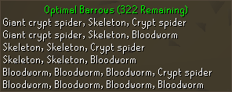

# Optimal Barrows Kills
A [Runelite](https://github.com/runelite/runelite) plugin for tracking optimal Barrows NPC kills.

# Overview
The Barrow's Reward Chest can be optimized by killing a collection of monsters whose combat levels sum to 880 
(or just below). Using the [Wiki's Recommended Kill Sets](https://oldschool.runescape.wiki/w/Barrows/Strategies#Optimising_the_average_value_of_the_rewards), 
we get the following:
- 6 Brothers, 1 Giant Crypt Spider, 1 Skeleton, and 1 Crypt Spider (880 points)
- 6 Brothers, 1 Giant Crypt Spider, 1 Skeleton, and 1 Bloodworm (876 points)
- 6 Brothers, 2 Skeletons and 1 Crypt Spider (878 points)
- 6 Brothers, 2 Skeletons and 1 Bloodworm (874 points)
- 6 Brothers, 3 Bloodworms and 1 Crypt Spider (880 points)
- 6 Brothers and 4 Bloodworms (876 points)

# Plugin
This plugin displays the remaining monsters that need to be killed in order to reach the target 880 points. After killing 
the first five brothers and entering the crypt, the plugin will display the potential kill sets to reach 880. As monsters 
are killed, the sets are updated to only show remaining viable sets. This plugin does not track sets with monsters outside 
the listed sets.

### Examples
- No Kills
  - Displays all sets
- 1 Skeleton Kill
  - 1 Giant Crypt Spider, 1 Crypt Spider
  - 1 Giant Crypt Spider, 1 Bloodworm
  - 1 Skeleton, 1 Crypt Spider
  - 1 Skeleton, 1 Bloodworm
- 2 Skeleton Kills
  - 1 Crypt Spider
  - 1 Bloodworm
- 3 Bloodworm Kills
  - 1 Bloodworm
- 1 Giant Crypt Spider, 1 Skeleton, 1 Crypt Spider
  - No remaining sets (target achieved)
- 1 Crypt Rat
  - No remaining sets (no viable sets contain 1 Crypt Rat)